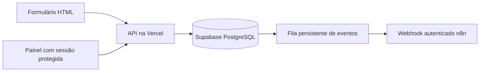

# Central de atendimento odontológico

Evolução de uma landing page para um fluxo de solicitações com backend, banco de dados, painel protegido e integração por webhook. Projeto educacional de portfólio: a clínica, os contatos e os atendimentos são demonstrativos.

- [Site publicado](https://siteodontologico-ten.vercel.app/)
- [Tour aberto, com dados fictícios](https://siteodontologico-ten.vercel.app/app/demo.html)
- [Painel da equipe](https://siteodontologico-ten.vercel.app/app/admin.html)
- [Verificar conexão do backend](https://siteodontologico-ten.vercel.app/api/health)

**Estado da implantação (25/09/2026):** site e API publicados na Vercel, conectados ao Supabase PostgreSQL. A conexão e o envio de uma solicitação fictícia pelo formulário público foram verificados em produção. O tour consulta a API e informa o estado real. O n8n ainda não está conectado; seus eventos ficam preservados na fila do banco. SQLite continua disponível para desenvolvimento local.

## O problema e o fluxo

O site original exibia um aviso ao clicar para agendar. Agora o formulário envia uma solicitação para a API, que valida os dados e salva o registro, o histórico e um evento de automação na mesma transação. A equipe acompanha o processo no painel.



Status permitidos: `novo → em_contato → agendado`. É possível cancelar em qualquer uma dessas etapas. Cancelamento encerra o fluxo. A data enviada é uma preferência, não uma reserva de agenda; a equipe combina o horário antes de marcar como agendado.

## O que está implementado

- API HTTP com validação no servidor, limite de tamanho e métodos explícitos.
- SQLite persistente para desenvolvimento; PostgreSQL/Supabase para nuvem.
- Chave de idempotência: repetir o mesmo envio não cria outro registro.
- Painel com autenticação, busca, filtro, paginação e histórico.
- Cookie HttpOnly/SameSite, Secure em HTTPS, com expiração em 8 horas.
- Verificação de origem nos pedidos de alteração e limite persistente de tentativas por IP anonimizado com hash.
- Controle de versão para impedir alterações simultâneas que sobrescrevam dados.
- Outbox transacional: uma falha no webhook não perde a solicitação.
- Tentativas com espera crescente, limite de 5 e reprocessamento administrativo.
- Webhook envia apenas IDs e status; não envia nome ou telefone.
- Tour público explicitamente ilustrativo, sem acesso aos registros da equipe.
- Testes de API, regras de negócio, falhas de integração e migração PostgreSQL.

## Rodar localmente

Requisito: Node.js 22.13+ (recomendado 24).

```powershell
npm ci
Copy-Item .env.example .env
# Edite .env: troque ADMIN_PASSWORD e SESSION_SECRET antes de iniciar.
npm run dev
```

Abra `http://localhost:3000`. O painel está em `/app/admin.html`. A senha é a definida em `ADMIN_PASSWORD`. Não existe senha pública de produção. O banco local fica em `work/atendimento.sqlite`, ignorado pelo Git. Não publique `.env` ou o arquivo SQLite.

```powershell
npm test
npm run build
```

## Publicar na Vercel com Supabase

1. Use um projeto Supabase dedicado a esta demonstração.
2. Execute `supabase/migrations/001_clinic.sql` uma única vez no SQL Editor.
3. Na Vercel, mantenha a raiz do projeto na raiz do repositório, Framework Preset **Other**, build `npm run build`, saída `dist` (configurados em `vercel.json`).
4. Configure as variáveis **Production** abaixo e faça um novo deploy.

| Variável | Valor |
|---|---|
| `APP_ORIGIN` | `https://siteodontologico-ten.vercel.app` |
| `SUPABASE_URL` | URL HTTPS do seu projeto Supabase |
| `SUPABASE_SERVICE_ROLE_KEY` | Chave secreta do servidor, nunca no HTML/JS público |
| `ADMIN_PASSWORD` | Senha exclusiva com no mínimo 16 caracteres |
| `SESSION_SECRET` | Segredo aleatório com no mínimo 32 caracteres |
| `N8N_WEBHOOK_URL` | Opcional: URL HTTPS de produção do workflow |
| `N8N_WEBHOOK_SECRET` | Opcional: segredo do Header Auth do webhook |

Não configure SQLite na Vercel: o filesystem das funções não é um banco persistente. A aplicação recusa esse uso em vez de simular uma gravação bem-sucedida. Em previews, `APP_ORIGIN` precisa corresponder à origem exata utilizada; mantenha banco de teste separado se habilitar envios em previews.

As tabelas têm RLS habilitado, sem acesso para `anon`/`authenticated`. A função RPC é acessível somente por `service_role`; toda operação passa pela API, que autoriza a leitura/alteração administrativa. As chaves não entram no build estático.

## Automação n8n

Importe `automations/n8n-atendimento.json`. O workflow recebe o evento, converte o status em uma próxima ação e responde com o ID recebido. As execuções ficam visíveis no n8n. Este fluxo não envia WhatsApp, e-mail ou SMS e não exige contas desses provedores.

1. No Webhook, configure uma credencial **Header Auth**, nome `X-Webhook-Secret`, com o mesmo valor de `N8N_WEBHOOK_SECRET`.
2. Publique/ative o workflow e copie a URL **Production**, não a URL de teste.
3. Salve URL e segredo nas variáveis do servidor e refaça o deploy.
4. Crie uma solicitação fictícia e verifique a execução no n8n e a fila no painel.

Cada criação/alteração tenta entregar um evento da fila. No painel, **Processar próximo evento** tenta um evento elegível; **Liberar novas tentativas** reinicia as tentativas dos eventos pendentes e tenta um. Não existe agendador periódico instalado. Se ninguém usar o sistema, eventos pendentes aguardam uma operação ou o processamento pelo painel.

Uma entrega é considerada recebida após HTTP 2xx. A entrega é **pelo menos uma vez**: se o n8n processar mas a resposta se perder, o mesmo `event_id` pode reaparecer. Antes de adicionar efeitos externos (mensagens, cobranças etc.), deduplique por `event_id` em armazenamento persistente no destino. O exemplo apenas transforma e confirma o evento, sem esses efeitos externos.

## API

| Rota | Método | Acesso | Função |
|---|---|---|---|
| `/api/health` | GET | Público | Testa a conexão do banco |
| `/api/leads` | POST | Público, mesma origem, limite por IP | Cria solicitação, exige `Idempotency-Key` |
| `/api/session` | POST / DELETE | Mesma origem | Login / logout |
| `/api/session` | GET | Equipe | Verifica a sessão |
| `/api/leads?offset=0` | GET | Equipe | Lista até 100 registros |
| `/api/leads` | PATCH | Equipe, mesma origem | Atualiza status com `id`, `status`, `version` |
| `/api/events?id=UUID` | GET | Equipe | Histórico da solicitação |
| `/api/automations` | GET / POST | Equipe | Consulta/processa fila |

Campos de criação: `name`, `phone`, `preferred_date` (YYYY-MM-DD), `period` (`manha`/`tarde`), `consent` (true). Data entre hoje e 90 dias no fuso de São Paulo; domingo indisponível, sábado somente manhã. Erros não expõem credenciais ou detalhes internos do banco.

## Testes e limites

`npm test` valida SQLite e o SQL PostgreSQL com PGlite, além de fazer requisições HTTP à API. Isso não substitui o teste de implantação: após configurar os serviços, verifique a gravação no Supabase, o login em HTTPS e a execução no n8n.

Este MVP tem um acesso administrativo compartilhado, sem MFA ou contas por funcionário. O logout remove o cookie do navegador; um cookie anteriormente copiado só expira ao fim do prazo ou ao trocar `SESSION_SECRET`. A fila não tem cron instalado, a retenção de dados é manual e não há confirmação automática de horários, prontuário, WhatsApp ou notificações externas. O limite por IP é básico, não uma solução completa contra abuso.

Antes de uso real: autenticação individual, política de retenção e exclusão, observabilidade, proteção contra abuso, recuperação de acesso e requisitos da clínica. Para este portfólio, use apenas dados fictícios.

## Estrutura e autoria

`index.html` mantém a página visual original. `site/` mantém sua versão com arquivos separados. `app/` contém formulário, painel e tour; `api/` expõe as rotas; `server/` concentra regras, segurança e persistência; `supabase/` contém a migração; `automations/` contém o workflow importável.

O backend foi desenvolvido com assistência de IA. Para apresentação profissional, diferencie o que você implementou, o que configurou, o que testou e o que ainda está aprendendo. Veja [o roteiro de estudo e apresentação](docs/portfolio-e-vaga.md).

Referências: [Vercel Functions](https://vercel.com/docs/functions/runtimes/node-js), [segurança da API Supabase](https://supabase.com/docs/guides/api/securing-your-api), [webhooks n8n](https://docs.n8n.io/integrations/builtin/core-nodes/n8n-nodes-base.webhook/).
